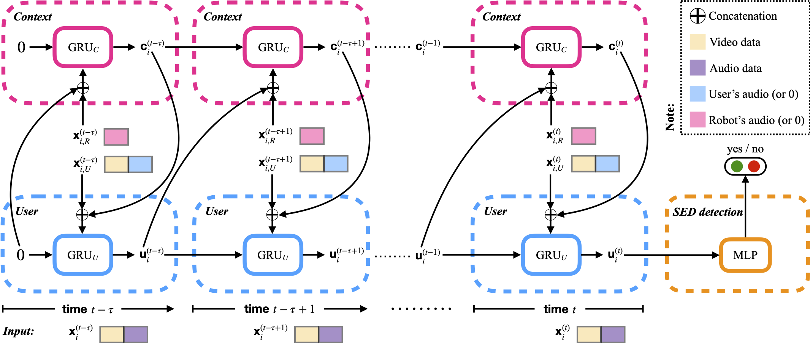

# HRI-RNN
## Presentation
This project contains the `Python/PyTorch` implementation of **HRI-RNN**, a recurrent GRU-based architecture for online detection of user's engagement decrease in human-robot interactions (see our INTERSPEECH 2020 paper *HRI-RNN: A User-Robot Dynamics-Oriented RNN for Engagement Decrease Detection* for a detailed description).

**HRI-RNN** differs from traditional engagement analysis models in that it explicitly uses the robot data to model the *context* of the interaction. Two GRUs—one modeling the user state and one modeling the context—are interconnected to capture the dependencies between the user and the robot (context).



## Classification Task
Given a relatively short HRI sequence of (multimodal) feature vectors—where features characterize either the user or the robot, we want to label the sequence as `1` if it presents signs of user's engagement decrease (SED) or `0` otherwise.

## Dataset
We use the **UE-HRI** dataset to train and test **HRI-RNN**. The `Python` script preprocessing raw HRI data can be found in the `Legacy` directory. For more details on feature extraction and data preprocessing, we refer the user to **Ben Youssef et al.**'s work, as this is outside the scope of this project.

The data we used for our INTERSPEECH 2020 paper (HRI sequences after feature extraction and the corresponding labels) can be downloaded [here](https://drive.google.com/file/d/11_msNw_h3UM_PovtY9frdWZfgzAaxvMi/view?usp=sharing).

## Installation and Prerequisites
In order to use our code, you can clone or donwload this `GitHub` repository. Make sure you have the following software/libraries installed:
- `Python 3.7`
- `PyTorch`
- `NumPy`
- `scikit-learn`

## Organization
This code is organized as follows:
- `Data`: can be downloaded [here](https://drive.google.com/file/d/11_msNw_h3UM_PovtY9frdWZfgzAaxvMi/view?usp=sharing). It corresponds to **UE-HRI** interaction sequences of `5 sec` and the corresponding labels, computed from the last `2 sec` of interaction. Default data repository name and location should be `./HRI-data/`.
- `data_utilities.py`: implements various methods for plotting statistics related to HRI data, such as the ratio of SED sequences, the distribution of the robot's speaking duration, etc
- `prepare_cross_validation_folds.py`: allows to split the dataset into `k` train, test, and validation folds (`k`-fold cross validation)
- `hri_dataset.py`: wraps HRI data in a `PyTorch` dataset so that it can be easily used in the training loop
- `modules.py`: contains implementation of HRI-RNN's architecture, as well as a simple GRU baseline
- `train.py`: trains **HRI-RNN** on one data fold and saves the best model (on validation set)
- `test.py`: evaluates the performance of **HRI-RNN** on test sets
- `Legacy`: directory containing data preprocessing code written by **A. Ben Youssef**

## How to Run Code
First, make sure to generate train, test, and validation data folds by running:
```
python prepare_cross_validation_folds.py
```
Default is `5`-fold cross-validation.

You can train **HRI-RNN** on one data fold with default hyperparameters by simply running:
```
python train.py 
```
See the function `main()` in `train.py` for hyperparameters documentation.

### Caveat
The default location for the result files returned by the code is the directory `./Output/`, which should be either created beforehand or customized by the user. 

## Credits
**Author:** Asma Atamna

**Original paper:** *HRI-RNN: A User-Robot Dynamics-Oriented RNN for Engagement Decrease Detection*. A. Atamna and C. Clavel. INTERSPEECH 2020
